```mermaid
erDiagram
    USUARIOS {
        uuid id PK "Identificador único"
        varchar full_name "Nombre completo"
        varchar email UK "Correo único"
        varchar password_hash "Contraseña encriptada"
        varchar role "estudiante|docente|administrador"
        boolean is_active "Estado activo"
        boolean email_verified "Email verificado"
        timestamp created_at "Fecha creación"
        timestamp updated_at "Fecha actualización"
    }

    ROLES {
        varchar role_value PK "estudiante|docente|administrador"
        text description "Descripción del rol"
        jsonb permissions "Permisos del rol"
    }

    PALABRAS {
        uuid id PK "Identificador único"
        varchar spanish_word "Palabra en español"
        varchar nasa_yuwe_word "Palabra en Nasa Yuwe"
        varchar pronunciation "Pronunciación fonética"
        text example_spanish "Ejemplo en español"
        text example_nasa_yuwe "Ejemplo en Nasa Yuwe"
        varchar audio_url "URL del audio"
        varchar image_url "URL de la imagen"
        varchar difficulty_level "facil|intermedio|avanzado"
        timestamp created_at "Fecha creación"
        timestamp updated_at "Fecha actualización"
    }

    ACTIVIDADES {
        uuid id PK "Identificador único"
        varchar title "Título de la actividad"
        text description "Descripción"
        varchar type "quiz|completar_oracion|asociar_imagen"
        varchar difficulty_level "facil|intermedio|avanzado"
        integer time_limit "Tiempo límite en segundos"
        integer passing_score "Puntuación mínima para aprobar"
        boolean is_active "Actividad activa"
        timestamp created_at "Fecha creación"
        timestamp updated_at "Fecha actualización"
    }

    RESULTADOS {
        uuid id PK "Identificador único"
        uuid activity_id FK "ID de la actividad"
        uuid student_id FK "ID del estudiante"
        integer score "Puntuación obtenida"
        integer total_questions "Total de preguntas"
        integer correct_answers "Respuestas correctas"
        integer time_taken "Tiempo empleado en segundos"
        boolean completed "Completada"
        timestamp started_at "Fecha de inicio"
        timestamp completed_at "Fecha de finalización"
        timestamp created_at "Fecha creación"
    }
```

# T2.2 – Modelado de Base de Datos
## Semillas de Maíz - Aplicación de Aprendizaje Nasa Yuwe

---

## 1. DEFINIR ENTIDADES: Usuarios, Roles, Palabras, Actividades, Resultados

### Descripción Breve:
Este diagrama define las cinco entidades principales del sistema: **Usuarios** (con sus roles: estudiante, docente, administrador), **Palabras** (diccionario español-Nasa Yuwe), **Actividades** (ejercicios de aprendizaje), y **Resultados** (intentos y respuestas de estudiantes). Cada entidad muestra sus atributos principales y tipos de datos.

### Código Mermaid:



---

## 2. DIAGRAMAR RELACIONES Y RESTRICCIONES

### Descripción Breve:
Este diagrama muestra todas las relaciones entre las entidades del sistema y las restricciones de integridad referencial. Incluye relaciones uno-a-muchos (1:N), muchos-a-muchos (N:M), y las reglas de eliminación (CASCADE, SET NULL). También visualiza las restricciones de dominio como valores permitidos en campos específicos.

### Código Mermaid:

```mermaid
erDiagram
    USUARIOS ||--o{ PALABRAS : "crea (ON DELETE SET NULL)"
    USUARIOS ||--o{ ACTIVIDADES : "crea (ON DELETE SET NULL)"
    USUARIOS ||--o{ GRUPOS : "enseña (ON DELETE CASCADE)"
    USUARIOS ||--o{ RESULTADOS : "realiza (ON DELETE CASCADE)"
    USUARIOS ||--o{ PROGRESO : "tiene (1:1 UNIQUE)"
    
    CATEGORIAS ||--o{ PALABRAS : "clasifica (ON DELETE SET NULL)"
    
    ACTIVIDADES ||--o{ PREGUNTAS : "contiene (ON DELETE CASCADE)"
    ACTIVIDADES ||--o{ RESULTADOS : "tiene (ON DELETE CASCADE)"
    
    PREGUNTAS ||--o{ OPCIONES_PREGUNTA : "tiene (ON DELETE CASCADE)"
    PREGUNTAS ||--o{ RESPUESTAS_ESTUDIANTE : "recibe (ON DELETE CASCADE)"
    
    RESULTADOS ||--o{ RESPUESTAS_ESTUDIANTE : "contiene (ON DELETE CASCADE)"
    
    GRUPOS ||--o{ GRUPO_ESTUDIANTES : "incluye (ON DELETE CASCADE)"
    USUARIOS ||--o{ GRUPO_ESTUDIANTES : "pertenece (ON DELETE CASCADE)"
    
    OPCIONES_PREGUNTA ||--o{ RESPUESTAS_ESTUDIANTE : "seleccionada_en (ON DELETE SET NULL)"

    USUARIOS {
        uuid id PK
        varchar email UK "UNIQUE NOT NULL"
        varchar role "CHECK: estudiante|docente|administrador"
        boolean is_active "DEFAULT true"
    }

    CATEGORIAS {
        uuid id PK
        varchar name UK "UNIQUE NOT NULL"
    }

    PALABRAS {
        uuid id PK
        uuid category_id FK "ON DELETE SET NULL"
        uuid created_by FK "ON DELETE SET NULL"
        varchar difficulty_level "CHECK: facil|intermedio|avanzado"
    }

    GRUPOS {
        uuid id PK
        uuid teacher_id FK "ON DELETE CASCADE"
        varchar education_level "CHECK: preescolar|primaria"
        varchar difficulty_level "CHECK: facil|intermedio|avanzado"
    }

    GRUPO_ESTUDIANTES {
        uuid id PK
        uuid group_id FK "ON DELETE CASCADE"
        uuid student_id FK "ON DELETE CASCADE"
        constraint unique_group_student "UNIQUE(group_id, student_id)"
    }

    ACTIVIDADES {
        uuid id PK
        uuid created_by FK "ON DELETE SET NULL"
        varchar type "CHECK: quiz|completar_oracion|asociar_imagen"
        varchar difficulty_level "CHECK: facil|intermedio|avanzado"
        integer passing_score "DEFAULT 70"
    }

    PREGUNTAS {
        uuid id PK
        uuid activity_id FK "ON DELETE CASCADE"
        varchar question_type "CHECK: multiple_choice|fill_blank|image_match"
    }

    OPCIONES_PREGUNTA {
        uuid id PK
        uuid question_id FK "ON DELETE CASCADE"
        boolean is_correct "DEFAULT false"
    }

    RESULTADOS {
        uuid id PK
        uuid activity_id FK "ON DELETE CASCADE"
        uuid student_id FK "ON DELETE CASCADE"
        boolean completed "DEFAULT false"
    }

    RESPUESTAS_ESTUDIANTE {
        uuid id PK
        uuid attempt_id FK "ON DELETE CASCADE"
        uuid question_id FK "ON DELETE CASCADE"
        uuid selected_option_id FK "ON DELETE SET NULL"
    }

    PROGRESO {
        uuid id PK
        uuid student_id FK UK "UNIQUE, ON DELETE CASCADE"
    }
```

---

## 3. CREAR MODELO LÓGICO

### Descripción Breve:
El modelo lógico representa la estructura completa de la base de datos con todas las tablas, sus atributos detallados, tipos de datos, claves primarias (PK), claves foráneas (FK), claves únicas (UK), y todas las relaciones entre entidades. Este modelo es la representación final que se implementa en PostgreSQL.

### Código Mermaid:

```mermaid
erDiagram
    USUARIOS ||--o{ PALABRAS : "crea"
    USUARIOS ||--o{ ACTIVIDADES : "crea"
    USUARIOS ||--o{ GRUPOS : "enseña"
    USUARIOS ||--o{ GRUPO_ESTUDIANTES : "pertenece"
    USUARIOS ||--o{ RESULTADOS : "realiza"
    USUARIOS ||--o{ PROGRESO : "tiene"
    USUARIOS ||--o{ AUDITORIA : "genera"
    
    CATEGORIAS ||--o{ PALABRAS : "clasifica"
    
    ACTIVIDADES ||--o{ PREGUNTAS : "contiene"
    ACTIVIDADES ||--o{ RESULTADOS : "tiene"
    
    PREGUNTAS ||--o{ OPCIONES_PREGUNTA : "tiene"
    PREGUNTAS ||--o{ RESPUESTAS_ESTUDIANTE : "recibe"
    
    RESULTADOS ||--o{ RESPUESTAS_ESTUDIANTE : "contiene"
    
    GRUPOS ||--o{ GRUPO_ESTUDIANTES : "incluye"
    
    OPCIONES_PREGUNTA ||--o{ RESPUESTAS_ESTUDIANTE : "seleccionada_en"

    USUARIOS {
        uuid id PK
        varchar_255 full_name "NOT NULL"
        varchar_255 email UK "UNIQUE NOT NULL"
        varchar_255 password_hash "NOT NULL"
        varchar_50 role "NOT NULL CHECK(role IN ('estudiante','docente','administrador'))"
        boolean is_active "DEFAULT true"
        boolean email_verified "DEFAULT false"
        varchar_255 verification_token
        varchar_255 reset_password_token
        timestamp reset_password_expires
        timestamp created_at "DEFAULT CURRENT_TIMESTAMP"
        timestamp updated_at "DEFAULT CURRENT_TIMESTAMP"
    }

    CATEGORIAS {
        uuid id PK
        varchar_100 name UK "UNIQUE NOT NULL"
        text description
        varchar_500 icon_url
        timestamp created_at "DEFAULT CURRENT_TIMESTAMP"
        timestamp updated_at "DEFAULT CURRENT_TIMESTAMP"
    }

    PALABRAS {
        uuid id PK
        varchar_255 spanish_word "NOT NULL"
        varchar_255 nasa_yuwe_word "NOT NULL"
        varchar_255 pronunciation
        text example_spanish
        text example_nasa_yuwe
        varchar_500 audio_url
        varchar_500 image_url
        uuid category_id FK "REFERENCES categories(id) ON DELETE SET NULL"
        varchar_50 difficulty_level "CHECK(difficulty_level IN ('facil','intermedio','avanzado'))"
        uuid created_by FK "REFERENCES users(id) ON DELETE SET NULL"
        timestamp created_at "DEFAULT CURRENT_TIMESTAMP"
        timestamp updated_at "DEFAULT CURRENT_TIMESTAMP"
    }

    GRUPOS {
        uuid id PK
        varchar_255 name "NOT NULL"
        varchar_50 education_level "NOT NULL CHECK(education_level IN ('preescolar','primaria'))"
        varchar_50 grade
        varchar_50 difficulty_level "CHECK(difficulty_level IN ('facil','intermedio','avanzado'))"
        uuid teacher_id FK "REFERENCES users(id) ON DELETE CASCADE"
        boolean is_active "DEFAULT true"
        timestamp created_at "DEFAULT CURRENT_TIMESTAMP"
        timestamp updated_at "DEFAULT CURRENT_TIMESTAMP"
    }

    GRUPO_ESTUDIANTES {
        uuid id PK
        uuid group_id FK "REFERENCES groups(id) ON DELETE CASCADE"
        uuid student_id FK "REFERENCES users(id) ON DELETE CASCADE"
        timestamp joined_at "DEFAULT CURRENT_TIMESTAMP"
        constraint unique_group_student "UNIQUE(group_id, student_id)"
    }

    ACTIVIDADES {
        uuid id PK
        varchar_255 title "NOT NULL"
        text description
        varchar_50 type "NOT NULL CHECK(type IN ('quiz','completar_oracion','asociar_imagen'))"
        varchar_50 difficulty_level "CHECK(difficulty_level IN ('facil','intermedio','avanzado'))"
        integer time_limit
        integer passing_score "DEFAULT 70"
        boolean is_active "DEFAULT true"
        uuid created_by FK "REFERENCES users(id) ON DELETE SET NULL"
        timestamp created_at "DEFAULT CURRENT_TIMESTAMP"
        timestamp updated_at "DEFAULT CURRENT_TIMESTAMP"
    }

    PREGUNTAS {
        uuid id PK
        uuid activity_id FK "REFERENCES activities(id) ON DELETE CASCADE"
        text question_text "NOT NULL"
        varchar_50 question_type "NOT NULL CHECK(question_type IN ('multiple_choice','fill_blank','image_match'))"
        varchar_500 image_url
        varchar_500 audio_url
        text correct_answer "NOT NULL"
        integer points "DEFAULT 1"
        integer order_number
        timestamp created_at "DEFAULT CURRENT_TIMESTAMP"
        timestamp updated_at "DEFAULT CURRENT_TIMESTAMP"
    }

    OPCIONES_PREGUNTA {
        uuid id PK
        uuid question_id FK "REFERENCES questions(id) ON DELETE CASCADE"
        text option_text "NOT NULL"
        varchar_10 option_label "NOT NULL"
        boolean is_correct "DEFAULT false"
        timestamp created_at "DEFAULT CURRENT_TIMESTAMP"
    }

    RESULTADOS {
        uuid id PK
        uuid activity_id FK "REFERENCES activities(id) ON DELETE CASCADE"
        uuid student_id FK "REFERENCES users(id) ON DELETE CASCADE"
        integer score "NOT NULL"
        integer total_questions "NOT NULL"
        integer correct_answers "NOT NULL"
        integer time_taken
        boolean completed "DEFAULT false"
        timestamp started_at "DEFAULT CURRENT_TIMESTAMP"
        timestamp completed_at
        timestamp created_at "DEFAULT CURRENT_TIMESTAMP"
    }

    RESPUESTAS_ESTUDIANTE {
        uuid id PK
        uuid attempt_id FK "REFERENCES activity_attempts(id) ON DELETE CASCADE"
        uuid question_id FK "REFERENCES questions(id) ON DELETE CASCADE"
        uuid selected_option_id FK "REFERENCES question_options(id) ON DELETE SET NULL"
        text student_answer
        boolean is_correct
        integer points_earned "DEFAULT 0"
        timestamp answered_at "DEFAULT CURRENT_TIMESTAMP"
    }

    PROGRESO {
        uuid id PK
        uuid student_id FK UK "UNIQUE REFERENCES users(id) ON DELETE CASCADE"
        integer total_activities_completed "DEFAULT 0"
        integer total_score "DEFAULT 0"
        decimal_5_2 average_score "DEFAULT 0"
        integer words_learned "DEFAULT 0"
        timestamp last_activity_date
        timestamp updated_at "DEFAULT CURRENT_TIMESTAMP"
    }

    AUDITORIA {
        uuid id PK
        uuid user_id FK "REFERENCES users(id) ON DELETE SET NULL"
        varchar_100 action "NOT NULL"
        varchar_100 entity_type
        uuid entity_id
        jsonb old_values
        jsonb new_values
        varchar_50 ip_address
        text user_agent
        timestamp created_at "DEFAULT CURRENT_TIMESTAMP"
    }
```

---

## Resumen de las Tres Secciones

### 1. Definir Entidades
**Propósito:** Identificar y describir las entidades principales del sistema (Usuarios con Roles, Palabras, Actividades, Resultados) con sus atributos fundamentales.

### 2. Diagramar Relaciones y Restricciones
**Propósito:** Visualizar cómo se relacionan las entidades entre sí y definir las reglas de integridad referencial (CASCADE, SET NULL) y restricciones de dominio (CHECK constraints, UNIQUE).

### 3. Crear Modelo Lógico
**Propósito:** Representar la estructura completa de la base de datos lista para implementación, incluyendo todos los detalles técnicos: tipos de datos precisos, valores por defecto, restricciones completas y todas las relaciones del sistema.

---

## Notas de Implementación

- **Base de Datos:** PostgreSQL
- **Extensiones requeridas:** uuid-ossp, pgcrypto
- **Triggers:** Actualización automática de `updated_at`
- **Índices:** Optimizados en claves foráneas y campos de búsqueda frecuente
- **Vistas:** `student_statistics`, `group_statistics` para consultas optimizadas
